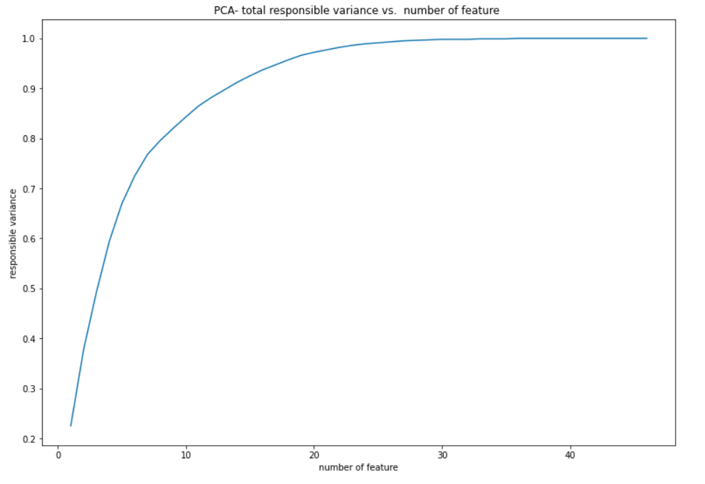
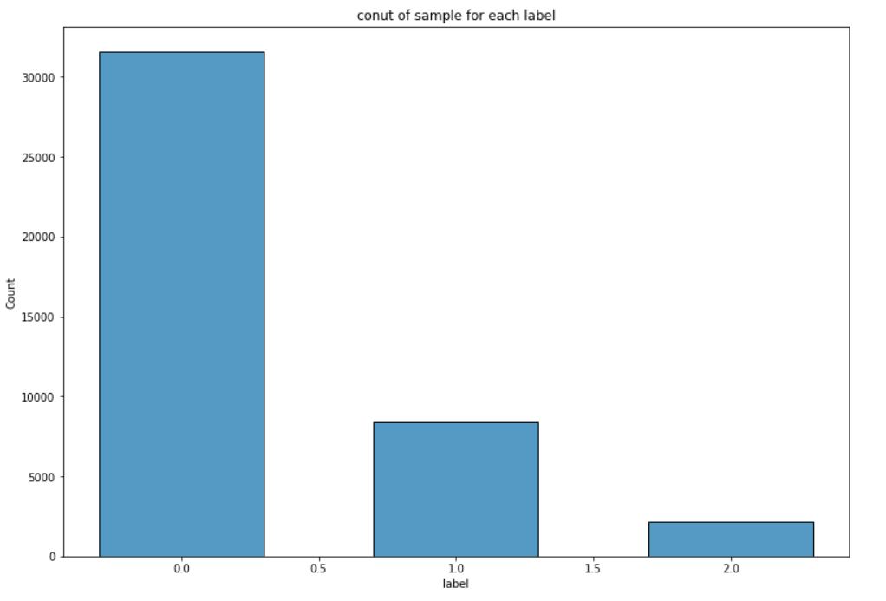
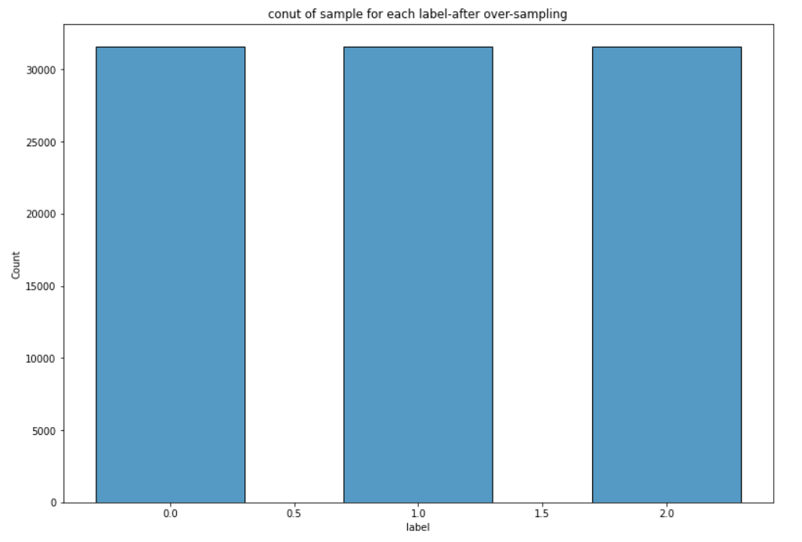

# Implement a pointwise learning to rank algorithm and train on LETOR4.0 dataset

## Prerequisites
- Python 3.6+
- Scikit-learn
- imblearn
- Pyspark

## Accuracy
| Model             | Acc.        |
| ----------------- | ----------- |
| Closed Form Model        | 75.61%      |
| SGDRegressor with oversampling       | 51.93%      |
| SGDRegressor        | 51.93%      |

## EDA
  ### Sparsity
  Reduce features dimension due to sparsity using PCA.
  
  <h3 align="center">
  
  </h3>
  Change the dimension from 46 to 30 would have no information-loss and speeds up training time.
  
  ### Class Imbalance
  Cope with class imbalance problem with oversampling.
  <h3 align="center">
  
  </h3>
  After oversampling, distribution of data separated by labels is shown below:
  <h3 align="center">
  
  </h3>
  
  
